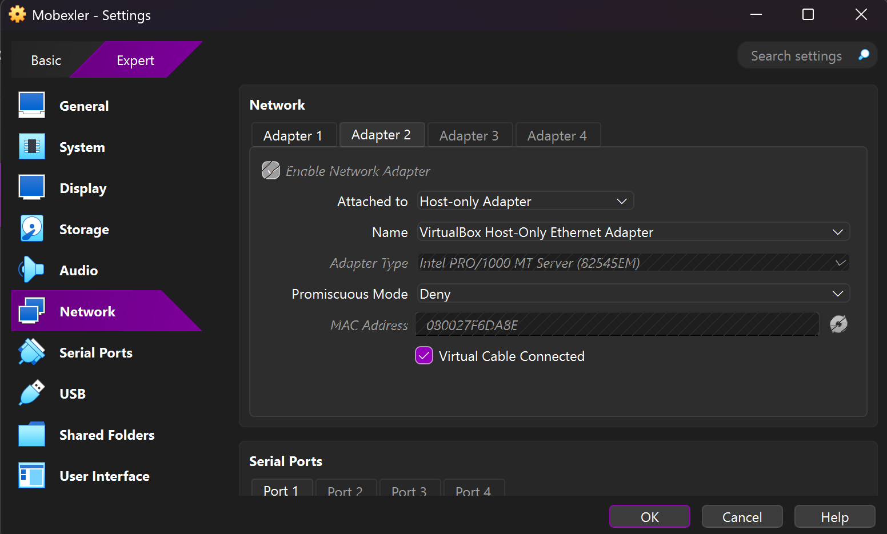
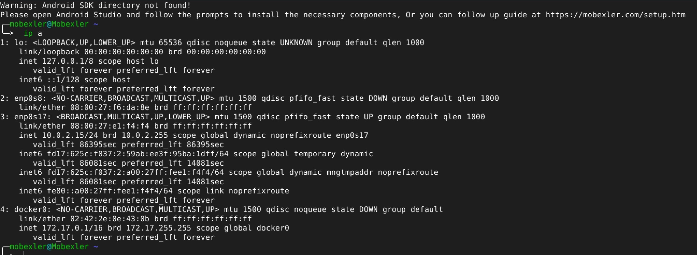
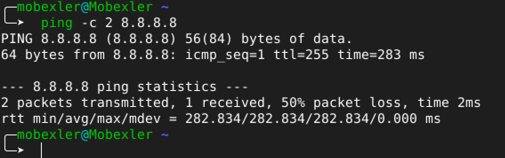
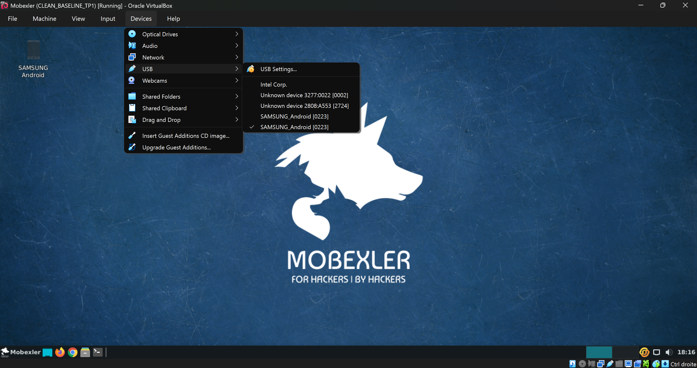
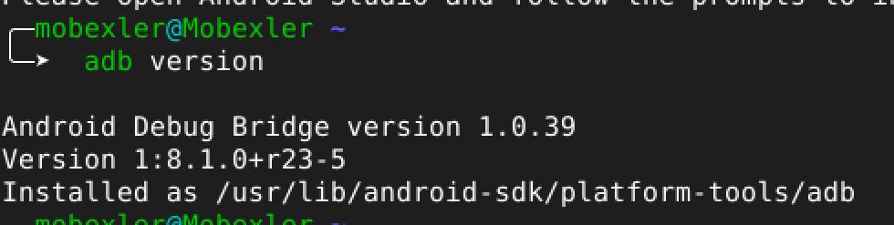
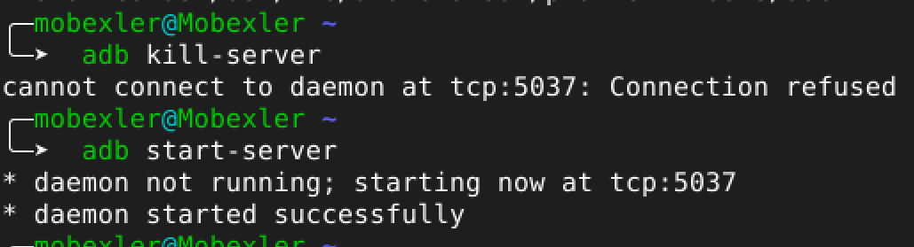
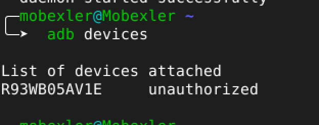

# Lab 1 : Mise en place du Lab Mobexler Snapshot Clean

## Description
Ce document détaille la mise en place d'un environnement d'audit complet pour la sécurité des applications mobiles, centré sur la distribution **Mobexler**. L'objectif est de préparer une station de travail (Mobexler) et une cible Android, configurées pour communiquer entre elles de manière sécurisée et reproductible.

## 2. Objectifs pédagogiques
Ce laboratoire vise à maîtriser les compétences suivantes :
- Installer et configurer une machine virtuelle dédiée au pentest mobile (Mobexler).
- Comprendre les mécanismes d'importation d'image OVA dans un hyperviseur.
- Vérifier la configuration réseau pour assurer la communication entre l'attaquant et la cible.
- Sécuriser l'état initial de l'environnement via la gestion des snapshots ("baseline").
- Préparer un émulateur ou un appareil Android pour le débogage et l'analyse.

## 3. Prérequis
Avant de commencer ce laboratoire, assurez-vous de disposer de :
- Un ordinateur hôte avec la virtualisation activée (VT-x / AMD-V).
- Un logiciel de virtualisation installé : **VirtualBox** (recommandé) ou **VMware Player/Workstation**.
- L'image OVA de **Mobexler** téléchargée.
- Une cible Android (Émulateur Genymotion, Android Studio AVD, ou appareil physique) prête à être utilisée.
- Espace disque suffisant (environ 20 Go) et au moins 4 Go de RAM alloués à la VM.

## 4. Étape 1 — Télécharger Mobexler (OVA) et tracer le téléchargement
Récupération de l'image disque officielle de Mobexler. Il est recommandé de vérifier l'intégrité du fichier téléchargé (hash SHA-256) pour s'assurer qu'il n'a pas été corrompu ou altéré.

## 5. Étape 2 — Importer l’OVA dans VirtualBox
Processus d'importation de l'application virtuelle (fichier `.ova`) dans l'hyperviseur.

## 6. Étape 3 — Premier démarrage + connexion
Lancement initial de la machine virtuelle Mobexler.

## 7. Étape 4 — Vérifier le réseau (tests “santé”)
Vérification de la connectivité réseau de la VM (commande `ping`, `ifconfig`/`ip a`).

## 8. Étape 5 — Créer le snapshot “CLEAN” (baseline)
Création d'un point de restauration sain avec la VM éteinte ou allumée.

## 9. Étape 6 — Préparer la cible Android ( Smartphone test via USB)
Configuration de l'appareil cible (smartphone physique ou émulateur).

---

## Résultat
L'environnement est maintenant opérationnel avec une machine d'attaque (Mobexler) saine, sauvegardée, et capable de communiquer avec une cible Android.

## Technologies utilisées
- **Mobexler**
- **VirtualBox**
- **Android Debug Bridge (ADB)**
- **AVD (Cible Android)**

